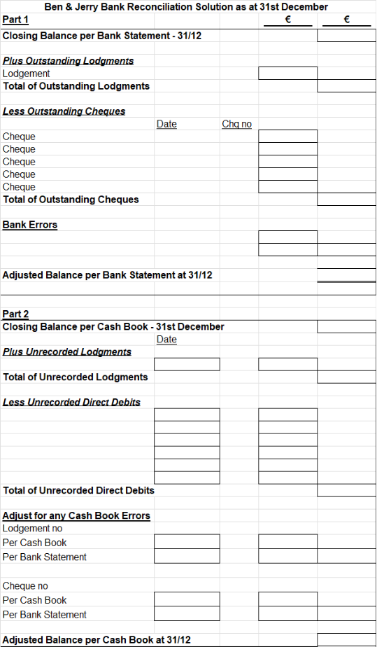


# Bank Reconciling Ben and Jerry Example

## Question 1

Ben and Jerry's cash and carry has problems reconciling its' bank statement to its cashbook. They have asked you to reconcile their cashbook to the bank statement up to the December 31. The following details are available

**Dr. Cash Book of  Ben & Jerry                                                       Cr.**

| **Date** | **Details** |      **€** | **Date** | **Details** | **Cheque No.** |      **€** |
|----------|-------------|-----------:|----------|-------------|----------------|-----------:|
| Dec-02   | Lodged  no1 |      1,201 | Dec-01   | Balance     |                |     €3,130 |
| Dec-09   | Lodged  no2 |      1,602 | Dec-02   |             | 8206           |        305 |
| Dec-18   | Lodged no 3 |      1,992 | Dec-04   |             | 8207           |        195 |
|          |             |            | Dec-05   |             | 8208           |        302 |
|          |             |            | Dec-05   |             | 8209           |        140 |
|          |             |            | Dec-06   |             | 8210           |        285 |
|          |             |            | Dec-06   |             | 8211           |        487 |
|          |             |            | Dec-07   |             | 8212           |        384 |
|          |             |            | Dec-16   |             | 8213           |        140 |
|          |             |            | Dec-16   |             | 8214           |        392 |
|          |             |            | Dec-20   |             | 8215           |        298 |
|          |             |            | Dec-21   |             | 8216           |        329 |
| 31/12    | Balance     |     €1,592 |          |             |                |            |
|          | **Total**   | **€6,387** | **       | **          | **Total**      | **€6,387** |

The Friendly Bank Statement of Ben and Jerry on December 31

| Date   | Details            | Payments | Lodgments | Balance |
|--------|--------------------|---------:|----------:|--------:|
| Dec-01 | Balance            |          |           |  -3,130 |
| Dec-02 | Bank Fees          |       45 |           |  -3,175 |
| Dec-03 | 45569              |      157 |           |  -3,332 |
| Dec-04 | 8206               |      305 |           |  -3,637 |
| Dec-05 | Lodged no 1        |          |     1,201 |  -2,436 |
| Dec-06 | Bank Interest      |      287 |           |  -2,723 |
| Dec-07 | 549856             |       93 |           |  -2,816 |
| Dec-11 | 8209               |      140 |           |  -2,956 |
| Dec-13 | Lodged  no 2       |          |     1,602 |  -1,354 |
| Dec-15 | 8207               |      195 |           |  -1,549 |
| Dec-17 | Cheque dishonoured |      450 |           |  -1,999 |
| Dec-19 | Rent               |      315 |           |  -2,314 |
| Dec-21 | Rates              |      204 |           |  -2,518 |
| Dec-23 | Lodged  no 3       |          |     1,982 | -   536 |
| Dec-25 | 8213               |      140 |           | -   676 |
| Dec-27 | 8214               |      492 |           |  -1,168 |
| Dec-29 | 8215               |      298 |           |  -1,466 |
| Dec-30 | Lodgment           |          |       414 |  -1,052 |
| Dec-31 | Bank charges       |      103 |           |  -1,155 |

**The bank has admitted that errors were made when cheques were drawn from Ben and Jerry’s bank account in error on 3rd and 7th of December.**

