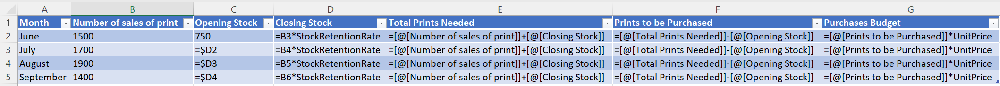

# Bus Decision Making And Apps - BUSS06073 - Exam Paper - 2024 - Summer

## Instructions

**Time Allowed:** 2 hours

**Instructions:** Answer 2 questions. All questions carry equal marks.

The use of programmable or text storing calculators is expressly forbidden.

Please note that where a candidate answers more than the required number of questions, the examiner will mark all questions attempted and then select the highest scoring ones.

Requirements for this paper:

1. Calculators

## Question 1 [Total Marks: 50]

### Question 1(a) [15 Marks]

The Burren Gift Shops bestselling product are photographic prints of the Cliffs of Moher. The policy for maintaining optimum stock levels is to keep 40% of the following months' projected sales of the prints in stock. Each print costs €20. The manager has provided details of projected sales for the next four months.

Details are as follows:

|                          |  June |  July | August | September |
|--------------------------|------:|------:|-------:|----------:|
| Number of sales of print | 1,500 | 1,700 |  1,900 |     1,400 |

At the 31st of May, the shop will have 750 prints in stock.

**Required:**
Prepare the monthly purchases budget in units and euros for the prints for the months June, July and August

#### Answer 1(a)

The first step is to calculate the number of prints required to be in stock at the end of each month. This is done by multiplying the projected sales for the following month by 40% and then adding the number of prints in stock at the end of the previous month.

| Month     | Projected Sales | 40% of Projected Sales | Number of Prints in Stock |
|-----------|-----------------|-----------------------:|--------------------------:|
| June      | 1,500           |                    600 |                     1,350 |
| July      | 1,700           |                    680 |                     2,050 |
| August    | 1,900           |                    760 |                     2,810 |
| September | 1,400           |                    560 |                     2,370 |

#### Answer 1(a) (ii)

1. **Calculate Required Ending Inventory:**

   For each month, the ending inventory is 40% of the following month's projected sales.

   - **June:**
     - Ending Inventory = 40% of July Sales
     - Ending Inventory = 0.40 * 1,700 = 680 prints
   - **July:**
     - Ending Inventory = 40% of August Sales
     - Ending Inventory = 0.40 * 1,900 = 760 prints
   - **August:**
     - Ending Inventory = 40% of September Sales
     - Ending Inventory = 0.40 * 1,400 = 560 prints

2. **Calculate Total Prints Needed:**

   Total prints needed each month is the sum of the projected sales for the month and the required ending inventory.

   - **June:**
     - Total Prints Needed = June Sales + Ending Inventory
     - Total Prints Needed = 1,500 + 680 = 2,180 prints

   - **July:**
     - Total Prints Needed = July Sales + Ending Inventory
     - Total Prints Needed = 1,700 + 760 = 2,460 prints

   - **August:**
     - Total Prints Needed = August Sales + Ending Inventory
     - Total Prints Needed = 1,900 + 560 = 2,460 prints

3. **Calculate Prints to be Purchased:**

   Prints to be purchased each month is the total prints needed minus the beginning inventory.

   - **June:**
     - Beginning Inventory = 750 prints (from the end of May)
     - Prints to be Purchased = Total Prints Needed - Beginning Inventory
     - Prints to be Purchased = 2,180 - 750 = 1,430 prints

   - **July:**
     - Beginning Inventory = Ending Inventory of June = 680 prints
     - Prints to be Purchased = 2,460 - 680 = 1,780 prints

   - **August:**
     - Beginning Inventory = Ending Inventory of July = 760 prints
     - Prints to be Purchased = 2,460 - 760 = 1,700 prints

4. **Calculate Cost of Prints to be Purchased:**

   Each print costs €20.

   - **June:**
     - Cost = 1,430 prints * €20 = €28,600

   - **July:**
     - Cost = 1,780 prints * €20 = €35,600

   - **August:**
     - Cost = 1,700 prints * €20 = €34,000

**Purchases Budget:**

| Month  | Prints to be Purchased | Cost (€) |
|--------|-----------------------:|---------:|
| June   |                  1,430 |   28,600 |
| July   |                  1,780 |   35,600 |
| August |                  1,700 |   34,000 |

### Question 1(b) [15 Marks]

> "Pay is a great motivator in achieving Budget Targets and Company Goals"

Discuss, providing one argument both for and against the above statement.

#### Answer 1(b)

**Argument For:**

Pay can be a powerful motivator for several reasons:

- **Direct Financial Incentive:** Higher pay or performance-based bonuses provide a direct financial benefit to employees, encouraging them to meet or exceed budget targets.
- **Recognition and Reward:** Increased pay or bonuses can serve as recognition for hard work and achievement, fostering a sense of accomplishment and encouraging continued effort.
- **Attract and Retain Talent:** Competitive pay helps attract skilled workers and retain existing employees, ensuring that the company has the necessary human resources to achieve its goals.
- **Improved Morale and Productivity:** Financial incentives can improve overall employee morale and productivity, leading to better performance and higher likelihood of meeting budget targets and company goals.

**Argument Against:**

However, there are also drawbacks to relying on pay as a motivator:

- **Short-Term Focus:** Pay incentives might lead to a short-term focus where employees aim to meet immediate targets at the expense of long-term objectives and sustainability.
- **Unhealthy Competition:** Excessive emphasis on pay can create unhealthy competition among employees, leading to a toxic work environment and undermining teamwork and collaboration.
- **Diminished Intrinsic Motivation:** Over-reliance on extrinsic rewards like pay can diminish intrinsic motivation, where employees might lose interest in their work and only focus on financial gains. MArco/Mini goal
- **Cost:** Financial incentives can be costly for the company, especially if not aligned properly with actual performance improvements, leading to inefficiencies and financial strain.

In conclusion, while pay can be an effective motivator, it needs to be balanced with other forms of recognition and support to ensure long-term success and employee well-being.

### Question 1(c) [20 Marks]

>"Poor attitudes or hostile behaviour can emerge, both at the planning stage of a Budget and at the implementation stage of a Budget."

Discuss the above statement providing appropriate examples from the workplace.

#### Answer 1(c)

Budget planning and implementation are critical stages in an organization's financial management process. However, they can also be sources of tension and conflict, leading to poor attitudes and hostile behavior among employees. Several factors contribute to this:

1. **Lack of Participation:**
   - When employees are excluded from the budgeting process, they may feel undervalued and disengaged. For instance, if departmental managers are not consulted while setting budget targets, they might view these targets as unrealistic or unfair, leading to resistance and lack of commitment.
2. **Unrealistic Expectations:**
   - Budgets that set overly ambitious targets without considering practical constraints can demoralize employees. For example, if sales teams are given unattainable sales targets, they may become frustrated, leading to decreased motivation and effort.
3. **Inadequate Communication:**
   - Poor communication during the budgeting process can result in misunderstandings and mistrust. If employees are not adequately informed about the reasons behind budget decisions, they may perceive them as arbitrary or biased, fostering resentment and hostility.
4. **Pressure and Stress:**
   - The pressure to meet budget targets can cause significant stress among employees. For instance, if cost-cutting measures are implemented without considering the workload and capacity of staff, it can lead to burnout, absenteeism, and even turnover.
5. **Blame Culture:**
   - When budget targets are not met, a blame culture may develop where individuals or departments are scapegoated. This can create a hostile work environment, where employees are more focused on avoiding blame than on collaborative problem-solving.

**Examples from the Workplace:**

- **Planning Stage:**
  - In a manufacturing company, the finance department sets a budget without consulting the production team. The production targets are unrealistic given the current machinery and workforce. This results in the production team feeling alienated and demotivated, leading to conflicts between departments.
- **Implementation Stage:**
  - In a retail company, budget cuts are made to reduce operational costs. However, the cuts are implemented without considering the impact on store staff, who are now expected to manage increased workloads with fewer resources. This leads to high stress, decreased job satisfaction, and increased staff turnover.

**Strategies to Mitigate Poor Attitudes and Hostile Behaviour:**

1. **Inclusive Budgeting Process:**
   - Involve employees at all levels in the budgeting process. Seek input from various departments to set realistic and achievable targets, ensuring buy-in and commitment.
2. **Transparent Communication:**
   - Clearly communicate the rationale behind budget decisions. Provide regular updates and be open to feedback, fostering a culture of trust and collaboration.
3. **Supportive Environment:**
   - Provide adequate support and resources to help employees meet budget targets. Recognize and address potential stressors, and promote a healthy work-life balance.
4. **Focus on Collaboration:**
   - Encourage teamwork and collective problem-solving rather than a blame culture. Recognize and reward collaborative efforts that contribute to achieving budget goals.

By addressing these factors, organizations can create a more positive and productive environment during both the planning and implementation stages of the budgeting process.

## Question 2 [Total Marks: 50]

Eve Fitzgerald runs a family-run business that operates Serenity Spa & Wellness Centre. Using the information set out below, Eve Fitzgerald has asked you to prepare a monthly cash flow forecast from May 2024 up to and including August 2024.

1. The company has forwarded the following sales forecast for the next 4 months.
    | Month  |       € |
    |--------|--------:|
    | May    |  85,000 |
    | June   |  95,000 |
    | July   | 105,000 |
    | August | 115,000 |
2. Sales comprise of 60% cash and the balance is collected 1 month later
3. All cash customers are given a cash discount of 1%
4. The direct cost of sales represents 35% of total sales
5. The company pays for its purchases as follows:
    - 25% of Purchases are paid for in cash in the month
    - The balance is paid one month in arrears
6. The company had purchased new salon equipment in April costing €12,000. They had previously purchased equipment from the same supplier in December 2023 amounting to €5,000 but there were unhappy with the quality and had refused to pay until they received a discount. It has been agreed with the suppliers that Eve will take 15% discount on December purchase. All relevant amounts will be paid in May.
7. The company will purchase a new motor vehicle amounting to €32,000 in May but this vehicle will not be paid for until June
8. Eve Fitzgerald will take out a loan for 85% of the purchase price of the motor vehicle in June. Repayments on the loan will be €550 each month and will begin in the month after receiving the loan
9. Wages of €25,000 are paid in cash each month with a 5% wage increase being implemented from June onwards
10. Rates of €48,000 per annum are paid in cash each month
11. Rent of €10,000 is paid in cash each month
12. Debtors' receipts collected in May 2024 will be €15,000
13. Creditors paid in May for purchases bought in April will be €12,000
14. The opening cash balance at the 1st of May 2024 was overdrawn by €3,500

**Required:**

### Question 2(a) [40 Marks]

Prepare a cash flow forecast for each month from May 2024 up to and including August 2024

#### Answer 2(a)

**Cash Flow Forecast for Serenity Spa & Wellness Centre (May 2024 - August 2024)**

**Assumptions and Calculations:**

1. **Sales Collection:**
   - 60% of sales are collected in the month of sale (with 1% discount).
   - 40% of sales are collected in the following month.

2. **Purchases Payment:**
   - 25% of purchases are paid in the month of purchase.
   - 75% of purchases are paid in the following month.

3. **Direct Cost of Sales:**
   - 35% of total sales.

**Cash Flow Forecast:**

| **Month**                                                                                     | **May 2024**                    | **June 2024** | **July 2024** | **August 2024** |
|-----------------------------------------------------------------------------------------------|---------------------------------|---------------|---------------|-----------------|
| **Opening Cash Balance**                                                                      | -3,500                          | 10,113        | 30,273        | 50,488          |
| **Cash Sales (60% of sales with 1% discount)**                                                | 50,490                          | 57,420        | 62,370        | 68,310          |
| **Collections from Previous Month's Credit Sales**                                            | 15,000                          | 34,000        | 38,000        | 42,000          |
| **Total Cash Inflows**                                                                        | 61,990                          | 91,420        | 100,370       | 110,310         |
|                                                                                               |                                 |               |               |                 |
| **Payments**                                                                                  |                                 |               |               |                 |
| Direct Cost of Sales (35%)                                                                    | 29,750                          | 33,250        | 36,750        | 40,250          |
| Payments for Purchases (75% of previous month's purchases + 25% of current month's purchases) | 9,500 + 7,438 = 16,938          | 22,688        | 25,063        | 27,438          |
| Equipment Purchase                                                                            | 15% discount on €5,000 = €4,250 | 32,000        |               |                 |
| Loan Repayment                                                                                |                                 | 27,200        | 550           | 550             |
| Wages                                                                                         | 25,000                          | 26,250        | 26,250        | 26,250          |
| Rates                                                                                         | 4,000                           | 4,000         | 4,000         | 4,000           |
| Rent                                                                                          | 10,000                          | 10,000        | 10,000        | 10,000          |
| Total Payments                                                                                | 99,938                          | 133,388       | 102,613       | 108,488         |
|                                                                                               |                                 |               |               |                 |
| **Net Cash Flow**                                                                             | -37,948                         | -41,968       | -2,243        | 1,823           |
| **Closing Cash Balance**                                                                      | 10,113                          | 30,273        | 50,488        | 70,133          |

**Calculations:**

1. **Cash Sales:**
   - May: 60% of €85,000 = €51,000 with 1% discount = €50,490
   - June: 60% of €95,000 = €57,000 with 1% discount = €56,430
   - July: 60% of €105,000 = €63,000 with 1% discount = €62,370
   - August: 60% of €115,000 = €69,000 with 1% discount = €68,310
2. **Collections from Previous Month's Credit Sales:**
   - May: €15,000
   - June: 40% of €85,000 = €34,000
   - July: 40% of €95,000 = €38,000
   - August: 40% of €105,000 = €42,000
3. **Direct Cost of Sales:**
   - May: 35% of €85,000 = €29,750
   - June: 35% of €95,000 = €33,250
   - July: 35% of €105,000 = €36,750
   - August: 35% of €115,000 = €40,250
4. **Payments for Purchases:**
   - Purchases are 35% of sales.
   - May: 75% of April purchases (€12,000) + 25% of May purchases (€29,750) = €9,000 + €7,438 = €16,938
   - June: 75% of May purchases (€29,750) + 25% of June purchases (€33,250) = €22,688
   - July: 75% of June purchases (€33,250) + 25% of July purchases (€36,750) = €25,063
   - August: 75% of July purchases (€36,750) + 25% of August purchases (€40,250) = €27,438
5. **Loan and Loan Repayments:**
   - Eve will take out a loan in June for 85% of €32,000 = €27,200
   - Loan repayment of €550 per month starting from July.
6. **Wages:**
   - May: €25,000
   - June: €25,000 + 5% = €26,250
   - July: €26,250
   - August: €26,250
7. **Rates:**
   - Monthly rate payment: €48,000 / 12 = €4,000
8. **Rent:**
   - Monthly rent payment: €10,000
9. **Equipment Purchase:**
   - May: €4,250 (after 15% discount on €5,000 purchase in December)
10. **Opening Cash Balance:**
    - May: -€3,500

**Closing Cash Balance Calculation:**

- **May:**
  - Opening Cash Balance: -€3,500
  - Net Cash Flow: -€37,948
  - Closing Cash Balance: €10,113
- **June:**
  - Opening Cash Balance: €10,113
  - Net Cash Flow: -€41,968
  - Closing Cash Balance: €30,273
- **July:**
  - Opening Cash Balance: €30,273
  - Net Cash Flow: -€2,243
  - Closing Cash Balance: €50,488
- **August:**
  - Opening Cash Balance: €50,488
  - Net Cash Flow: €1,823
  - Closing Cash Balance: €70,133

### Question 2(b) [10 Marks]

Eve Fitzgerald is anticipating a budgeted cash surplus over the next one to two years. Discuss the appropriate action that management may take to capitalise on this projected surplus.

#### Answer 2(b)

**Answer:**

Eve Fitzgerald is anticipating a budgeted cash surplus over the next one to two years. To capitalize on this projected surplus, management may consider several appropriate actions:

1. **Reinvest in the Business:**
   - Invest in upgrading or expanding the Serenity Spa & Wellness Centre. This could include renovating facilities, adding new services, or purchasing new equipment to enhance customer experience and attract more clients.
2. **Debt Reduction:**
   - Use the surplus to pay down existing debts. This will reduce interest expenses and improve the financial health of the business, providing more flexibility in the long term.
3. **Emergency Fund:**
   - Set aside a portion of the surplus as an emergency fund. This will provide a financial cushion to handle unexpected expenses or economic downturns, ensuring business stability.
4. **Marketing and Promotion:**
   - Invest in marketing campaigns to increase brand awareness and attract new customers. This could include online marketing, social media advertising, or special promotions and events.
5. **Employee Development:**
   - Invest in training and development programs for employees. Enhancing their skills and knowledge can improve service quality and employee satisfaction, leading to higher productivity and customer loyalty.
6. **New Ventures:**
   - Consider diversifying the business by exploring new ventures or revenue streams related to the wellness industry. This could include launching new products, services, or even opening additional locations.
7. **Technology Upgrades:**
   - Invest in technology to streamline operations, improve customer experience, and enhance efficiency. This could include upgrading booking systems, implementing customer relationship management (CRM) software, or improving the website and online booking capabilities.
8. **Shareholder Returns:**
   - If the business is family-run, consider distributing a portion of the surplus as dividends to shareholders. This can provide a return on investment and increase shareholder satisfaction.

By strategically investing the projected surplus, Eve Fitzgerald can strengthen the business, improve its competitive position, and ensure long-term growth and sustainability.

## Question 3 [Total Marks: 50]

### Question 3(a) [20 Marks]

Set out below is the cashbook and bank statement of Jean Smith:

**Cash Book of Jean Smith**  

| *Dr.* Date | Details      |      € | *Cr.* Date | Details     | Cheque No. |      € |
|------------|--------------|-------:|------------|-------------|-----------:|-------:|
| 04/04/2024 | Lodgment 524 |  4,256 | 01/04/2024 | Balance b/d |            |  2,520 |
| 10/04/2024 | Lodgment 525 |  3,984 | 04/04/2024 | Cheque      |        862 |    359 |
| 17/04/2024 | Lodgment 526 |  8,652 | 04/04/2024 | Cheque      |        863 |  2,420 |
| 30/04/2024 | Lodgment 527 |  7,600 | 08/04/2024 | Cheque      |        864 |  3,256 |
|            |              |        | 10/04/2024 | Cheque      |        865 |  1,250 |
|            |              |        | 10/04/2024 | Cheque      |        866 |    750 |
|            |              |        | 19/04/2024 | Rent        |         DD |  5,000 |
|            |              |        | 20/04/2024 | Cheque      |        867 |  1,450 |
|            |              |        | 24/04/2024 | Cheque      |        868 |     80 |
|            |              |        | 27/04/2024 | Cheque      |        869 |    249 |
|            |              |        | 28/04/2024 | Cheque      |        870 |  2,750 |
|            |              |        | 30/04/2024 | Balance c/d |            |  4,408 |
|            |              |        |            |             |            |        |
|            |              | 24,492 |            |             |            | 24,492 |

**Bank Statement of Jean Smith as at 30/04/2024**  

| Date       | Details            |           | Payments | Lodgments | Balance |
|------------|--------------------|----------:|---------:|----------:|--------:|
| 01/04/2024 | Balance            |           |          |     4,206 |  -2,520 |
| 03/04/2024 | Vodafone           |        DD |    1,200 |           |  -3,720 |
| 04/04/2024 | Lodgement          |       524 |          |           |     486 |
| 05/04/2024 |                    |       862 |      359 |           |     127 |
| 05/04/2024 |                    |       863 |    2,420 |           |  -2,293 |
| 05/04/2024 | Energia            |        DD |      900 |           |  -3,193 |
| 09/04/2024 | Cheque Dishonoured |           |      450 |           |  -3,643 |
| 11/04/2024 | Lodgement          |       525 |          |     3,984 |     341 |
| 17/04/2024 | Lodgement          |           |          |     2,500 |   2,841 |
| 18/04/2024 |                    | 872459424 |          |     1,800 |   4,641 |
| 19/04/2024 | Rent               |        DD |    5,000 |           |    -359 |
| 20/04/2024 |                    | 872459297 |      550 |           |    -909 |
| 21/04/2024 |                    |       866 |      750 |           |  -1,659 |
| 25/04/2024 |                    |       867 |    1,650 |           |  -3,309 |
| 28/04/2024 |                    |       869 |      249 |           |  -3,558 |
| 28/04/2024 | Lodgement          |       526 |          |     8,652 |   5,094 |
| 30/04/2024 | Credit charges     |        DD |      550 |           |   4,544 |

The bank has admitted that an error was made in relation to the lodgement into the account on the 18th April 2024 for €1,800 and also the payment that was paid out of the bank account on the 20th for €550.

### Question 3(a) [40 Marks]

Reconcile the bank statement balance with the cash book balance at the 30th of April 2024

### Question 3(b) [10 Marks]

Discuss the benefit of regularly preparing bank reconciliation statements.

## Paper College Details

College: Technological University of the Shannon: Midlands Midwest  
Module Title: Business Decision Making and Apps  
Module Code: BUSS06073  
Year of Study: 1  
Year: 2024 - Summer  
Code on Paper: 49a93c78  

### Programmes

| Code         | Programme                                                                          |
|--------------|------------------------------------------------------------------------------------|
| LC_BBEMM_KMY | Bachelor of Business (Honours) Business Studies with Event Management              |
| LC_HBEAM_JMY | Bachelor of Arts Business Studies with Beauty and Spa Management                   |
| LC_HBEAM_IMY | Higher Certificate in Arts in Business Studies with Beauty and Spa Management      |
| LC_BTTMM_IMY | Higher Certificate in Business Studies with Travel and Tourism Management          |
| LC_BTTMM_JMY | Bachelor of Business Studies with Travel and Tourism Management                    |
| LC_BBEMM_JMY | Bachelor of Business Studies with Event Management                                 |
| LC_BTTMM_KMY | Bachelor of Business (Honours) Business Studies with Travel and Tourism Management |
| LC_BBEMM_IMY | Higher Certificate in Business Studies with Event Management                       |
| LC_HBBEM_KMY | Bachelor of Arts (Honours) Business Studies with Beauty and Spa Management         |

### Examiners

| Examiner         |          |
|------------------|----------|
| Margaret Hogan   | Internal |
| Rachelle O'Brien | External |

---
