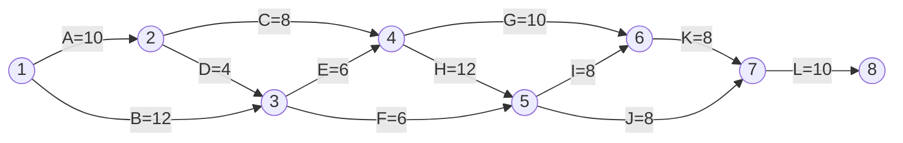
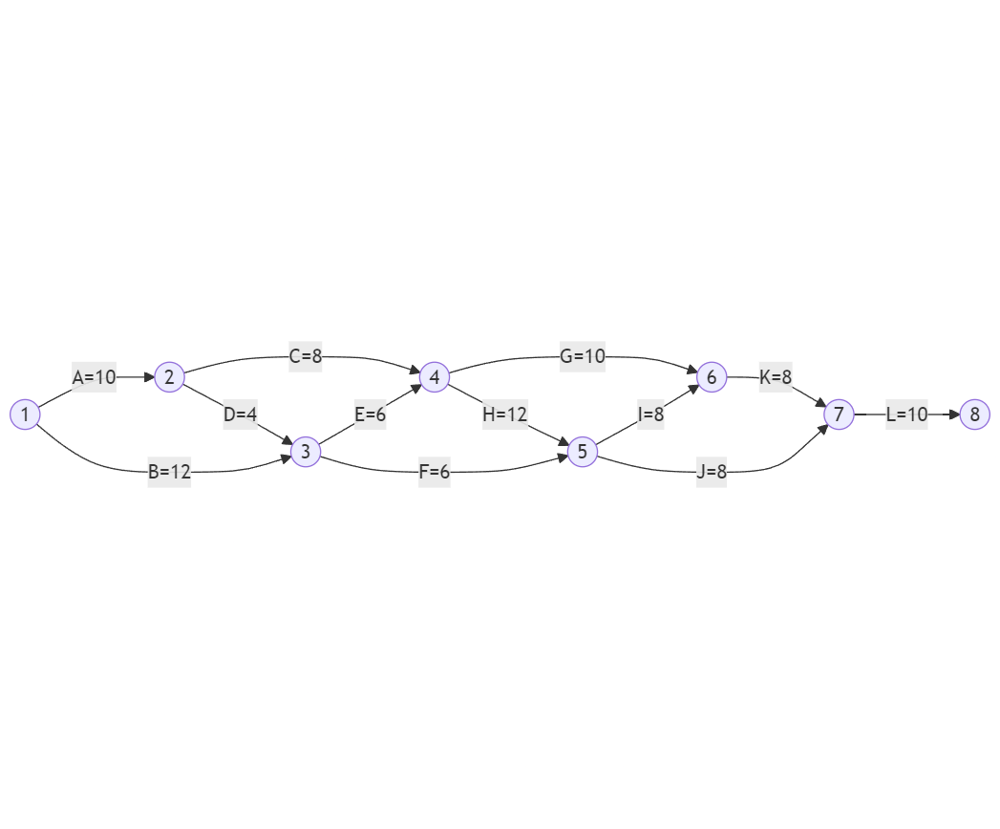
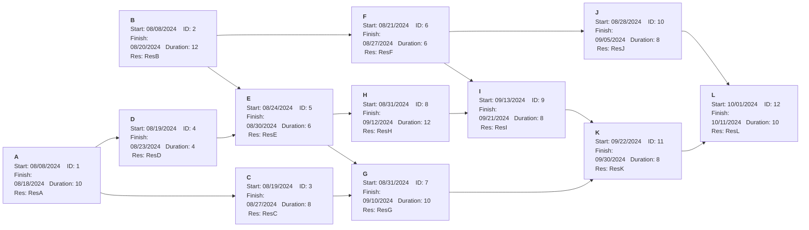
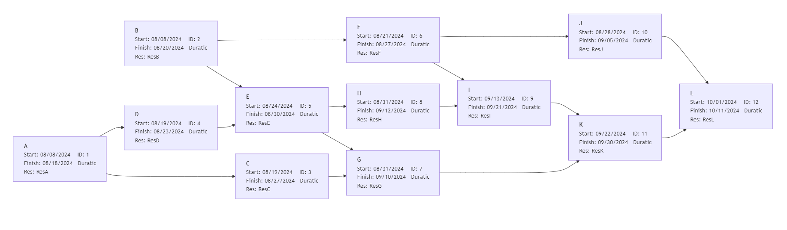

# MGMT06065 – Project Management
### Summer Examinations 2023/2024

---

## Question 1

| Activity | Initial Node | Final Node | Estimated Duration |
|----------|--------------|------------|--------------------|
| A        | 1            | 2          | 10                 |
| B        | 1            | 3          | 12                 |
| C        | 2            | 4          | 8                  |
| D        | 2            | 3          | 4                  |
| E        | 3            | 4          | 6                  |
| F        | 3            | 5          | 6                  |
| G        | 4            | 6          | 10                 |
| H        | 4            | 5          | 12                 |
| I        | 5            | 6          | 8                  |
| J        | 5            | 7          | 8                  |
| K        | 6            | 7          | 8                  |
| L        | 7            | 8          | 10                 |

*Table 1.*

Table 1 shows the tasks and task dependencies for a project. You are required to:

### Question 1.A (12 marks)

Draw an AOA network diagram representing the project. Place the node numbers in circles and draw arrows from node to node, labeling each arrow with the activity letter and estimated time.  

### Answer 1.A

### Question 1.B (11 marks)

Identify and list all of the paths on the network diagram and the duration of each path.  

### Answer 1.B

1. **Path 1**: `1 -> 2 -> 4 -> 6 -> 7 -> 8`  
   Duration = `10 + 8 + 10 + 8 + 10 = 46`

2. **Path 2**: `1 -> 2 -> 3 -> 4 -> 6 -> 7 -> 8`  
   Duration = `10 + 4 + 6 + 10 + 8 + 10 = 48`

3. **Path 3**: `1 -> 2 -> 3 -> 5 -> 6 -> 7 -> 8`  
   Duration = `10 + 4 + 6 + 8 + 8 + 10 = 46`

4. **Path 4**: `1 -> 3 -> 4 -> 6 -> 7 -> 8`  
   Duration = `12 + 6 + 10 + 8 + 10 = 46`

5. **Path 5**: `1 -> 3 -> 5 -> 6 -> 7 -> 8`  
   Duration = `12 + 6 + 8 + 8 + 10 = 44`

6. **Path 6**: `1 -> 3 -> 5 -> 7 -> 8`  
   Duration = `12 + 6 + 8 + 10 = 36`

Thus, the paths and their corresponding durations are listed as shown above.

### Question 1.C (10 marks)

Identify the critical path of the project and explain the importance of the critical path.  

### Answer 1.C

**Critical Path Identification:**

To identify the critical path, we need to determine which of the paths has the longest duration. The critical path is the sequence of activities that determines the minimum time required to complete the project. Any delay in this path will delay the entire project.

From the paths and durations listed earlier:

1. **Path 1**: `1 -> 2 -> 4 -> 6 -> 7 -> 8`  
   Duration = 46

2. **Path 2**: `1 -> 2 -> 3 -> 4 -> 6 -> 7 -> 8`  
   Duration = 48

3. **Path 3**: `1 -> 3 -> 4 -> 6 -> 7 -> 8`  
   Duration = 46

4. **Path 4**: `1 -> 3 -> 5 -> 6 -> 7 -> 8`  
   Duration = 44

5. **Path 5**: `1 -> 3 -> 5 -> 7 -> 8`  
   Duration = 36

**Critical Path:** The critical path is **Path 2: `1 -> 2 -> 3 -> 4 -> 6 -> 7 -> 8`** with a duration of **48 units of time**.

**Importance of the Critical Path:**

The critical path is crucial because it determines the shortest possible duration to complete the project. The importance of the critical path includes:

1. **Project Duration**: The critical path dictates the minimum project completion time. Any delay in an activity on the critical path will directly delay the entire project.

2. **Resource Allocation**: Activities on the critical path require careful monitoring and efficient allocation of resources since any delays can impact the overall project timeline.

3. **Risk Management**: Identifying the critical path helps project managers focus on the most crucial activities. By ensuring these activities stay on schedule, the risk of project delays can be minimized.

4. **Scheduling and Control**: The critical path provides a clear picture of the essential tasks that need priority attention, allowing for better scheduling and control of the project.

By focusing on the critical path, project managers can ensure timely project completion and better manage potential risks and delays.

If say Path 5 is delayed by 2 units of time, the path duration of path 5 will be 36 + 2 = 38. This will not affect the project duration as it is not on the critical path. However, if Path 2 is delayed by 2 units of time, the path duration of path 2 will be 48 + 2 = 50. This will affect the project duration as it is on the critical path.

## Alternate Question 1

Given the following project activities and their dependencies, draw a Precedence Diagramming Method (PDM) network diagram. Place the activity nodes in boxes and draw arrows from node to node, indicating the dependencies between the activities. Represent each activity the given fields and indicate dependencies between activities them.

| ID | Activity | Preceding Activity | Start     | Finish     | Duration | Resources |
|----|----------|--------------------|-----------|------------|----------|-----------|
| 1  | A        | -                  | 8/8/2024  | 8/18/2024  | 10       | ResA      |
| 2  | B        | -                  | 8/8/2024  | 8/20/2024  | 12       | ResB      |
| 3  | C        | A                  | 8/19/2024 | 8/27/2024  | 8        | ResC      |
| 4  | D        | A                  | 8/19/2024 | 8/23/2024  | 4        | ResD      |
| 5  | E        | B, D               | 8/24/2024 | 8/30/2024  | 6        | ResE      |
| 6  | F        | B                  | 8/21/2024 | 8/27/2024  | 6        | ResF      |
| 7  | G        | C, E               | 8/31/2024 | 9/10/2024  | 10       | ResG      |
| 8  | H        | E                  | 8/31/2024 | 9/12/2024  | 12       | ResH      |
| 9  | I        | F, H               | 9/13/2024 | 9/21/2024  | 8        | ResI      |
| 10 | J        | F                  | 8/28/2024 | 9/5/2024   | 8        | ResJ      |
| 11 | K        | G, I               | 9/22/2024 | 9/30/2024  | 8        | ResK      |
| 12 | L        | J, K               | 10/1/2024 | 10/11/2024 | 10       | ResL      |

*Table 2.*

*Table 2.*

### Alternate Question 1.A (12 marks)

**Draw a PDM Network Diagram**: Create a Precedence Diagramming Method (PDM) network diagram to represent the project's activities and their dependencies. Use rectangles for activity nodes and arrows to indicate the sequence.

### Alternate Answer 1.A

### Alternate Question 1.B (11 marks)

**Identify the Critical Path**: After drawing the network diagram, identify and list the critical path(s) for the project, showing the total duration of the critical path.

### Alternate Answer 1.B

**Identifying the Critical Path:**

To identify the critical path, we need to calculate the total duration of each path in the project and identify the path(s) with the longest duration, as the critical path is the one that determines the minimum time needed to complete the project.

Based on the network diagram and the dependencies, here are the possible paths:

1. **Path 1:** A -> C -> G -> K -> L
   - Duration = 10 (A) + 8 (C) + 10 (G) + 8 (K) + 10 (L) = **46 days**

2. **Path 2:** A -> D -> E -> G -> K -> L
   - Duration = 10 (A) + 4 (D) + 6 (E) + 10 (G) + 8 (K) + 10 (L) = **48 days**

3. **Path 3:** B -> E -> G -> K -> L
   - Duration = 12 (B) + 6 (E) + 10 (G) + 8 (K) + 10 (L) = **46 days**

4. **Path 4:** B -> F -> I -> K -> L
   - Duration = 12 (B) + 6 (F) + 8 (I) + 8 (K) + 10 (L) = **44 days**

5. **Path 5:** B -> F -> J -> L
   - Duration = 12 (B) + 6 (F) + 8 (J) + 10 (L) = **36 days**

6. **Path 6:** A -> D -> E -> H -> I -> K -> L
   - Duration = 10 (A) + 4 (D) + 6 (E) + 12 (H) + 8 (I) + 8 (K) + 10 (L) = **58 days**

**Critical Path:** The critical path is **Path 6: A -> D -> E -> H -> I -> K -> L** with a total duration of **58 days**.

### Alternate Question 1.C (10 marks)

**Explain the Importance of the Critical Path**: Provide a brief explanation of why the critical path is significant in project management.

### Alternate Answer 1.C

**Importance of the Critical Path:**

The critical path is a crucial concept in project management for several reasons:

1. **Project Completion Time**: The critical path determines the shortest possible time to complete the project. Knowing the critical path allows project managers to focus on the activities that cannot be delayed without affecting the overall project timeline.

2. **Resource Allocation**: By identifying the critical path, project managers can allocate resources more effectively. Activities on the critical path must be prioritized in terms of resource allocation, as any delay in these tasks directly impacts the project’s completion date.

3. **Risk Management**: Understanding the critical path helps in identifying potential risks. Since any delay on the critical path will delay the project, project managers can monitor these activities closely and develop contingency plans to mitigate risks.

4. **Project Control**: The critical path provides a clear framework for monitoring and controlling the project. Project managers can use the critical path to track progress, ensuring that the project stays on schedule.

5. **Decision Making**: In case of unforeseen circumstances or changes in project scope, understanding the critical path allows project managers to make informed decisions regarding schedule adjustments, resource reallocation, or prioritization of tasks.

In summary, the critical path is essential for ensuring that the project is completed on time, within scope, and with optimal resource usage. It serves as the backbone of effective project planning and execution.

## Question 2 (33 marks)

Managing the "triple constraint" (i.e., scope, cost, and time) of project management is often described as the most important job of a project manager. Discuss in detail EACH of these three constraints and explain why EACH of them is important to the overall success of the project.  

---

## Question 3

a) As a project manager, you have been contacted by an employee who is unhappy with her role within the project. As the employee is important to the success of the project, you offer her an immediate pay rise to solve the issue. Is this likely to be an effective strategy for resolving this issue? Explain your answer.  
**(12 marks)**

b) As part of your project management style, you have a tendency to be conciliatory when addressing likely conflicts within a project. Is this approach likely to be successful in the long term? Explain your answer.  
**(11 marks)**

c) You are concerned that a preponderance of meetings are having a negative effect on the productivity of your project. Provide any FOUR tips on running effective meetings.  
**(10 marks)**

**[End of Question 3]**

---

## Question 4

Recent trends affecting Information Technology Project Management include Globalisation, Outsourcing, and Virtual Teams. Discuss any TWO of these topics.  
**(Total Marks: 33)**

**[End of Question 4]**

---

**[END OF EXAM]**
